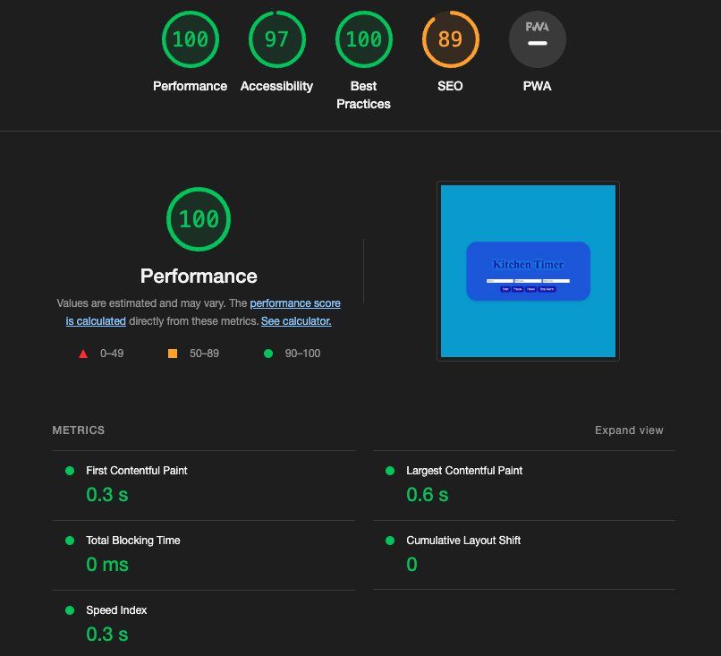
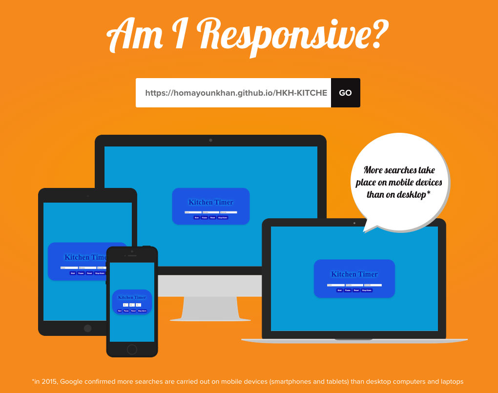

# Kitchen Timer

A simple web-based kitchen timer designed to help you keep track of time while cooking or performing other tasks. The timer is built using HTML, CSS, and JavaScript.

## Features

- Responsive Design: The timer interface adapts to different screen sizes, making it easy to use on both desktop and mobile devices.
- Converting any number: Users can input any number of hours, minutes, and seconds and the timer will convert it to the correct time format.
- Alarm: When the timer reaches zero, an alarm sound will play.

## How to Use

1. Open the `index.html` file in a web browser.
2. Enter the desired hours, minutes, and seconds in the input fields.
3. Click the "Start" button to start the timer.
4. Optionally, you can pause, reset, or stop the alarm using the provided buttons.

## Sections

- `index.html`: The main HTML file containing the structure of the timer interface.
- `styles.css`: The CSS file for styling the timer interface.
- `script.js`: The JavaScript file containing the timer functionality and event listeners.

## Testing
The website has been tested with the following web browsers:

- Chrome 
- Firefox
- Microsoft Edge

To test the timer, simply open the `index.html` file in your preferred web browser and interact with the user interface.

## Known Bugs

As of now, there are no known bugs. If you find any issues, please report them in the project's issue tracker.

## Validator Testing (w3c.org)

The HTML and CSS files have been validated using the W3C Markup Validation Service (https://validator.w3.org/). No errors or warnings were found.

## Note

This project is intended for educational purposes and is not intended for commercial use.

## Credits

This web application completely was created by Homayoun Khanmohammadi and all right reserved for Autor.
